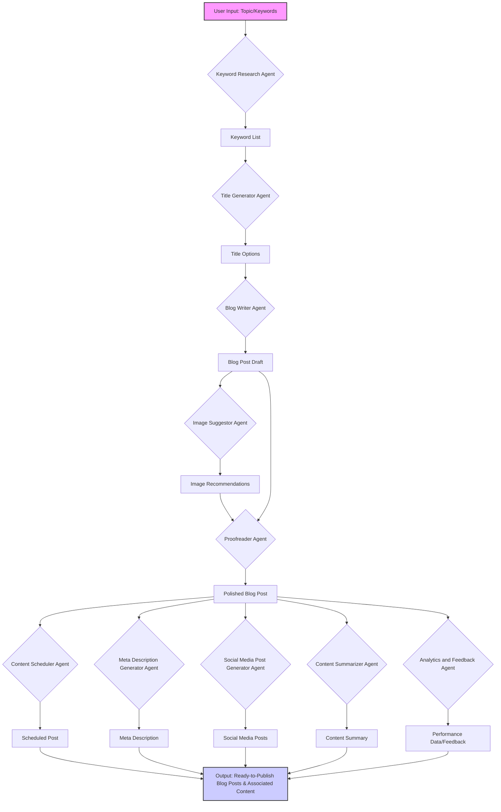

# BlogAI: Your Automated Blog Post Generation Powerhouse

BlogAI is a cutting-edge tool designed to revolutionize the way you create blog content. It automates the entire process of generating multiple, high-quality blog posts on a given topic. By leveraging a suite of specialized agents, BlogAI ensures that each post is well-crafted, engaging, SEO-friendly, and error-free. Whether you're a seasoned blogger, a content marketer, or a business owner, BlogAI empowers you to produce a consistent stream of valuable content with minimal effort.

## Core Features

*   **Automated Content Creation:** Generate multiple blog posts from a single topic input.
*   **Specialized Agents:** Each agent focuses on a specific aspect of blog creation, ensuring quality and consistency.
*   **SEO Optimization:** Content is crafted with search engine visibility in mind, incorporating relevant keywords and best practices.
*   **High-Quality Output:** Blog posts are well-structured, informative, engaging, and free of grammatical errors.
*   **Time-Saving:** Drastically reduces the time and effort required to produce a large volume of blog content.
*   **Customization:** Tailor the tone, style, and focus of your blog posts to match your brand and audience.
*   **Variety:** Explore different angles and perspectives on the same topic, providing a diverse range of content.

## The BlogAI Agents: Your Content Creation Team

BlogAI's power comes from its team of specialized agents, each with a unique role in the content creation process.

Here's a list of the agents:

*   [Title Generator Agent](agents.md#1-title-generator-agent)
*   [Blog Writer Agent](agents.md#2-blog-writer-agent)
*   [Proofreader Agent](agents.md#3-proofreader-agent)
*   [Keyword Research Agent](agents.md#4-keyword-research-agent)
*   [Meta Description Generator Agent](agents.md#5-meta-description-generator-agent)
*   [Image Suggestor Agent](agents.md#6-image-suggestor-agent)
*   [Social Media Post Generator Agent](agents.md#7-social-media-post-generator-agent)
*   [Content Summarizer Agent](agents.md#8-content-summarizer-agent)
*   [Content Scheduler Agent](agents.md#9-content-scheduler-agent)
*   [Analytics and Feedback Agent](agents.md#10-analytics-and-feedback-agent)

For detailed descriptions of each agent, please refer to the [Agents Documentation](agents.md).

## How BlogAI Works: A Step-by-Step Guide

1.  **Topic Input:** The user inputs a single topic or a set of related keywords.
2.  **Keyword Research:** The Keyword Research Agent identifies relevant keywords and phrases related to the topic.
3.  **Title Generation:** The Title Generator Agent creates a list of potential titles based on the input topic and keyword research.
4.  **Content Creation:** For each title generated, the Blog Writer Agent produces a unique and comprehensive blog post.
5.  **Image Suggestion:** The Image Suggestor Agent recommends relevant images to enhance each blog post.
6.  **Proofreading:** The Proofreader Agent reviews each generated blog post, making necessary corrections and improvements.
7.  **Meta Description Generation:** The Meta Description Generator Agent creates optimized meta descriptions for each post.
8.  **Social Media Post Generation:** The Social Media Post Generator Agent creates engaging social media posts to promote each blog post.
9.  **Content Summarization:** The Content Summarizer Agent creates concise summaries for each post.
10. **Content Scheduling:** The Content Scheduler Agent allows users to schedule the publication of their blog posts.
11. **Analytics and Feedback:** The Analytics and Feedback Agent tracks the performance of the blog posts and provides insights.
12. **Output:** The tool outputs a collection of polished, ready-to-publish blog posts on the given topic, along with associated meta descriptions, social media posts, and summaries.

## Benefits of Using BlogAI

*   **Efficiency:** Automates the blog creation process, saving time and effort by generating multiple articles from a single topic input.
*   **Quality:** Ensures high-quality, well-researched, and error-free content.
*   **SEO-Friendly:** Generates content that is optimized for search engines, improving visibility and reach.
*   **Variety:** Produces a variety of articles on the same topic, providing a range of perspectives and angles.
*   **Consistency:** Maintains a consistent tone and style across all generated content.
*   **Scalability:** Easily scale your content production to meet your growing needs.
*   **Cost-Effective:** Reduces the need for hiring multiple writers and editors.

## Example Workflow

Let's say a user wants to create content about "Benefits of Remote Work." Here's how BlogAI would handle it:

1.  **User Input:** The user inputs the topic "Benefits of Remote Work."
2.  **Keyword Research:** The Keyword Research Agent identifies keywords like "remote work advantages," "work-life balance," "productivity," "telecommuting," etc.
3.  **Title Generation:** The Title Generator Agent produces titles such as:
    *   "Top 10 Benefits of Remote Work for Employees"
    *   "How Remote Work Improves Work-Life Balance"
    *   "The Environmental Impact of Remote Work"
    *   "Remote Work vs. Office Work: Which is More Productive?"
    *   "Boosting Productivity: The Hidden Benefits of Remote Work"
4.  **Content Creation:** The Blog Writer Agent generates detailed blog posts for each title, ensuring each post is unique and informative.
5.  **Image Suggestion:** The Image Suggestor Agent recommends images of people working from home, collaborating online, etc.
6.  **Proofreading:** The Proofreader Agent reviews and polishes each blog post.
7.  **Meta Description Generation:** The Meta Description Generator Agent creates optimized meta descriptions for each post.
8.  **Social Media Post Generation:** The Social Media Post Generator Agent creates engaging social media posts to promote each blog post.
9.  **Content Summarization:** The Content Summarizer Agent creates concise summaries for each post.
10. **Content Scheduling:** The Content Scheduler Agent allows the user to schedule the publication of the blog posts.
11. **Analytics and Feedback:** The Analytics and Feedback Agent tracks the performance of the blog posts.
12. **Output:** The user receives a collection of high-quality blog posts on the topic "Benefits of Remote Work," along with associated meta descriptions, social media posts, and summaries.

## Getting Started with BlogAI

BlogAI is designed to be user-friendly, making it accessible to both experienced bloggers and beginners. With its advanced features and comprehensive approach, BlogAI is the ultimate tool for creating engaging and high-quality blog posts efficiently.

[Instructions on how to get started with the tool would go here, such as installation, setup, etc.]

## Diagram of the Workflow

